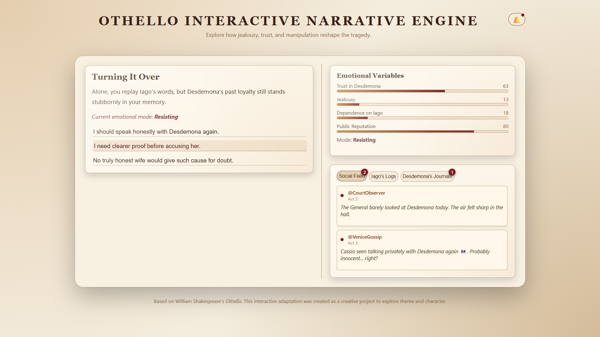

# 📜 *Othello: Interactive Manuscript*

### An Interactive Narrative Experience Inspired by Shakespeare’s *Othello*

A fully original **ENG4U Creative Task** reimagining Shakespeare’s *Othello* as a modern interactive manuscript blending story, emotional simulation, and character-perspective documents.

Built using **React**, **Vite**, and deployed via **Vercel**.

---

## ⭐ Overview

**Othello: Interactive Manuscript** is a story-driven, choice-based interactive web experience that explores the psychological unraveling of Othello through:

* A **branching narrative** based on user decisions
* A dynamic **emotional stat simulation** (Jealousy, Trust, Dependence)
* **Iago’s Deception Logs**
* **Desdemona’s Private Journals**
* A fictional **Social Feed** reflecting public perception

The project presents the tragedy through a **manuscript-style UI**, creating an immersive 1600s aesthetic while still allowing modern user interactivity.

This work fulfills the requirements of the **ENG4U Creative Shakespeare Task**, demonstrating creative reinterpretation, understanding of themes, and technical execution.

---

## 🎭 Features

### 🧠 **Branching Interactive Narrative**

* 20+ scenes (macro + micro choices)
* Multiple unique paths and outcomes
* Logical state-driven branching (flags + emotional scores)

---

### 💔 **Emotional Simulation System**

Your choices influence three emotional metrics:

| Stat           | Description                                        |
| -------------- | -------------------------------------------------- |
| **Jealousy**   | Measures Othello’s rising suspicion and insecurity |
| **Trust**      | His belief in Desdemona, Cassio, and himself       |
| **Dependence** | His emotional reliance on Iago                     |

Final endings are determined by statistical thresholds + triggered narrative flags.

---

### 📜 **Authentic Manuscript Aesthetic**

* Custom parchment-styled layout
* Medieval serif typography
* Subtle page-fade transitions
* Handwritten-style accents
* Thin parchment-colored scrollbars
* Feather/quill favicon

---

### 🗂️ **Three Integrated Story Panels**

1. **📣 Social Feed**

   * Public rumours, soldiers’ comments, and gossip
   * Unlocks dynamically based on your choices

2. **🩸 Iago’s Logs**

   * His private manipulation notes
   * Updates when new schemes unfold

3. **🌸 Desdemona’s Journal**

   * Personal thoughts and emotional reflections
   * Gives meta-perspective on the relationship

---

### 🔔 **Interactive Notification System**

* Global notification bell
* Per-tab unread badges
* Per-item “unread” dot indicators
* Auto-scroll to newly unlocked items
* Item highlight animation
* Dismissable notifications

---

### ✨ **Smooth UX Enhancements**

* Fade-in scene transitions
* Animations for new logs/journals/feed items
* Clean scroll behavior
* Elegant tab interactions

---

## 🧩 Tech Stack

* **React 18**
* **Vite**
* **JavaScript (ES2022)**
* **Vercel Deployment**
* **Vercel Speed Insights + Web Analytics**
* CSS-based animations

---

## 🚀 Running the Project Locally

```bash
npm install
npm run dev
```

Open:
`http://localhost:5173/`

---

## 🌐 Deployment

Live deployment handled via **Vercel**.
Includes:

* Speed Insights
* Web Analytics
* Custom project domain
* Automatic production builds

---

## 🖼️ Screenshots




---

## 📚 Educational Purpose

This project was created as part of the **ENG4U: Grade 12 English** curriculum.
It serves as:

* A creative reinterpretation of Shakespeare’s *Othello*
* A demonstration of deep character understanding
* A multi-modal literary and technical artifact
* A modern engagement with classical text themes

---

## 👤 Author

**Taheem**
Grade 12 • ENG4U Creative Task
Built with React + Vite + Vercel

---

## 📄 License

This project is intended for educational use.

---